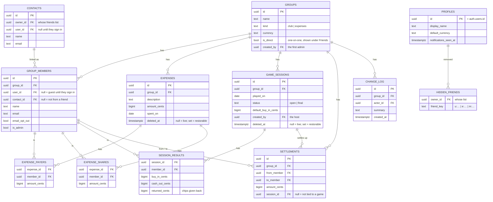
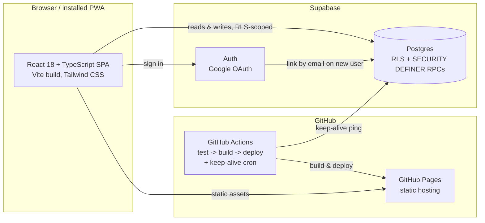

# Chip n Split — Design Document

This document covers the product design, data model, and architecture decisions behind Chip n
Split. It is the **blueprint**: [SPEC.md](../SPEC.md) turns it into numbered, testable rules (the
contract every change is checked against), and the [README](../README.md) covers setup and
day-to-day usage. Change order for any feature: this design → SPEC.md rule → failing test → code.

---

## 1. Product overview

### Problem

Splitting money with the same group of people, repeatedly, over a long time, is two problems
that existing tools solve separately: Splitwise-style apps handle shared expenses well but have
no concept of a recurring game night with buy-ins and cash-outs; poker-tracking apps handle the
table but not the pizza everyone chipped in for afterward. Friend groups end up running both,
manually reconciling between them.

### Target users

A friend or family group — not a business, not a marketplace. Trust between members is assumed;
the design optimizes for low friction (no invites-and-approvals ceremony, no per-transaction
fees, no ads) over protecting strangers from each other.

### Core principles

- **One ledger, two activities.** Card games and shared expenses settle through the same
  balances, because in practice the people you play with are often the people you split the
  pizza with. Each group has one job — a **Club** tracks games, an **Expenses** group (or a
  one-on-one) tracks costs — and your standing with each friend adds up across all of them.
- **Exact money, always.** Every amount is integer cents internally; splits use largest-remainder
  distribution so a three-way split of $10.00 is always $3.34 + $3.33 + $3.33 — never a penny
  lost to rounding, never a value that doesn't sum back to the original total.
- **No account required to participate.** Someone can be added to a group by name alone (a
  "Guest"), or by email (an "Invited" friend who auto-links the moment they sign in with a
  matching address) — full participation in the ledger doesn't require anyone to sign up first.
- **Free to run, indefinitely.** Static hosting, a free-tier database, and `mailto:` links
  instead of a transactional email service. The cost structure was a design constraint, not an
  afterthought — see [§6 Non-goals](#6-non-goals-and-deliberate-scope-boundaries).

---

## 2. Feature design

### Clubs and games

A **Club** is a standing group for people who play together repeatedly. Creating one is a
one-time action; starting a new game inside it is not — a club supports unlimited games over
its lifetime, each an independent record (a club can run more than one game in a single day,
since nothing is keyed to a calendar date). Starting a new game defaults the player roster to
the club's membership (or the previous game's roster, if there was one), so the common case —
"same crew as last time" — takes one tap.

A game moves through two states: **open** (buy-ins/cash-outs are still being entered) and
**final** (locked; the settle-up list is generated from the results). Finalizing requires the
table to balance — total cash-out must equal total buy-in — which catches counting mistakes
before they become a wrong debt. A game belongs to its **host**, whoever started it: only they
can change its numbers, finalize or reopen it, mark its payments, or delete it, while everyone
else in the club follows along live (see [§4 Security model](#4-security-model)). Games with no
recorded host fall back to the club's admins. Any member can start a game. Deleting a game takes
the payments recorded against it out with it, so balances return to exactly what they were before
the game. A deleted game is kept (`game_sessions.deleted_at`) with its results and payments, out of
every balance, and its host can restore it from the club's History exactly as it was (0025).

A club tracks games only — there's no way to add an expense to one. Expenses a club picked up
before that rule still show on its Expenses tab and still count toward its balances.

### Expenses

Standard Splitwise-style shared expenses, with one deliberate extension: **shares-based
splitting**. Beyond equal, exact-amount, and percentage splits, an expense can be split by
weight ("Madhu owes 2 shares, everyone else owes 1") — useful for the common real case where
costs aren't actually equal per person. All four modes share one selection UI (tap a person in
or out) rather than four different interaction patterns, and percentage splits default to an
even distribution of 100% rather than starting at zero, since "everyone splits this evenly" is
the common case even within the percentage mode.

A **one-on-one expense** from the dashboard or a friend's page handles the one-off case — "we
ate out, one person paid, that's the whole interaction" — without making a group. It lives in a
small hidden "direct" group (`groups.is_direct`), reusing the one that already exists for that
set of people, so splits, payments, and history work like any other expense while staying out of
the Groups list and showing under Friends instead.

Any member of the group can add, edit, delete, and restore an expense (0025). A deleted expense is
kept (`deleted_at`) and can be restored from the group's History.

One person can end up with more than one one-on-one with the same friend (each of you started
one). The friend page adds them up into one **Balance** per currency, and **Settle** records the
payment in the one-on-one that owes most in that direction. An empty one-on-one (an "Add expense"
that was cancelled, or one whose expenses were all deleted) is not shown and doesn't count as
something shared.

### Friends

A personal address book, independent of any one group — the same friend, once added, can be
reused across every club or expense group without retyping. Three states describe where a
friend is in their relationship with the app, and are surfaced directly wherever a friend is
listed:

- **Friend** — linked to a real, signed-in account.
- **Invited** — added with an email; will auto-link the moment they sign in with that address.
- **Guest** — name only, no email on file.

**Names.** A signed-up person's name is their own profile name, confirmed on first sign-in and
carried into every group, friends list, and rummy game they're linked in (0020). Nobody else can
change another person's name or email except the app admin, through `admin_update_person()`,
which fixes a guest or invited person in every group and friends list at once (0023). A trigger
on `group_members` and `contacts` enforces this against direct API calls too.

Matching a returning member to their existing history is done by email, case-insensitively, at
the moment they first sign in (see `handle_new_user()` in the schema) — so someone who was
added as a guest to three different groups over a year, then finally signs up, sees all three
retroactively connect to their account without anyone doing anything.

**What you share.** Each friend row says *2 shared groups* (real groups only), *one-on-one* (a
one-on-one with an expense, game, or payment in it, settled or not), or *nothing shared yet*.

**Removing a friend.** Anyone on the list (friend, invited, or guest) can be removed, but only
once you're settled up with them in every currency. Because people also appear just by sharing a
group, removal is remembered by friend key in `hidden_friends` (0024) rather than by deleting
anything. A removed friend comes back automatically if a balance with them opens again, or if you
add them as a friend again, so money owed is never hidden.

**Sort order.** The Friends list and the Dashboard list the biggest amount first, whether you're
owed or you owe, with settled-up people last.

### Balances, settling up, and reminders

Balances reduce to one number per person per group (see [§3 Data model](#3-data-model)); a
minimum-cash-flow algorithm turns that into the fewest payments that clear everyone. Settling
up is deliberately low-ceremony — record a payment in one tap, with a method and note for your
own records, no approval step from the other side. The Dashboard and Friends page show each
friend's balance summed across every group and one-on-one you share, per currency.

Zero-infrastructure communication tools sit on top of this, under one **Share** button:

- **Email summary** — a `mailto:` link with the date, place (for a game), everyone's balance,
  and the settle-up list, with a game's already-recorded payments marked paid. A game's summary
  covers only the people who played; a group's covers every member. Members can be opted out
  of the recipient list per group.
- **Share image** — the same summary drawn as a colored PNG in the browser (canvas), handed to
  the phone's share sheet, or downloaded on desktop.
- **Reminder** — a `mailto:` addressed to just the one person who owes a specific payment.

All of these trade "automatic" for "no email provider, no API key, no cost."

### History and notifications

Every write to a group is logged in plain English (`change_log`) — who added, edited, or
deleted what, when. A notification bell surfaces this across every group a person belongs to,
with an unread count, so staying current doesn't require checking each group individually.

### Governance: members, hosts, and admins

Everyone in a group is trusted with the day-to-day: any **member** can add, edit, delete, and
restore expenses, start a game, record a payment, and add people. A **game** is run by its
**host**, whoever started it. Only **admins** can change group settings, make someone else admin,
or delete the group (clubs and expense groups alike). Whoever creates a group is its first and
only admin; everyone added later joins as a member, and an admin can promote others (0025). A
group always keeps at least one admin. This mirrors real social structure: one owner who can
reshape or close the group, everyone else free to use it.

---

## 3. Data model

### Entity overview

All tables reference Supabase's built-in `auth.users` for identity — there is no separate user
table to keep in sync. The full column-level schema lives in `supabase/migrations/`, applied as
a single ordered sequence; that directory is the source of truth, not this document.

### Key decisions

**Money as integer cents, everywhere.** No floating point anywhere near a dollar amount. Splits
are computed with largest-remainder distribution (`src/lib/money.ts`), so a total always equals
the exact sum of its parts.

**One net balance per person per group.** Every event — an expense, a finalized game, a
settlement — is just a signed adjustment to a running per-member total (`groupBalances()` in
`src/lib/ledger.ts`). This single representation is what lets expenses, games, and payments all
settle through the same minimum-cash-flow algorithm (`src/lib/settle.ts`) without needing
separate logic per event type.

**Friends are decoupled from group membership.** `contacts` is a private, per-account address
book; `group_members` is the per-group roster. A person can exist in one without the other (a
friend not yet in any shared group; a group co-member never personally added as a friend), and
`friendKey()` — matching by linked account, then email, then a per-row fallback — merges the
two views into one identity wherever they overlap, so the same person is never shown twice.

**Settlement is an invariant, not a convention.** A group's balances always sum to zero; the
database enforces (not just the UI) that a group or a finalized game cannot be deleted while
unsettled, and that only a game's host can change its results.

**Delete means hide, where it can be undone.** Expenses and games are soft-deleted (`deleted_at`):
they drop out of every balance and settle-up list, stay in the database, and come back exactly as
they were on restore. Removing a friend is the same idea (`hidden_friends`). Groups are the one
real delete, and only once settled. See
[§4](#4-security-model).

---

## 4. Security model

No custom backend exists — the browser talks to Supabase directly with the public anon key.
Row-level security (RLS) in Postgres is therefore the entire application-layer security
boundary, not a secondary check behind a server. Every policy resolves through a small set of
`SECURITY DEFINER` helper functions so a policy can never be bypassed by manipulating RLS on the
table it depends on:

| Function | Answers |
|---|---|
| `is_group_member(gid)` | Can this user see this group's data at all? |
| `is_group_admin(gid)` | Can this user change settings or delete things in this group? |
| `group_is_settled(gid)` | Does every member's balance in this group net to zero? |
| `session_is_settled(sid)` | Does every player's balance in this game net to zero? |

**Admin-gated actions** (changing group settings, promoting or demoting an admin, deleting a
group) check `is_group_admin`. Expenses, starting a game, and recording a group payment check
only `is_group_member` — participation stays open to every member (0025). Changing or deleting a game, and marking
its payments, is limited to the game's host (`game_sessions.created_by`), falling back to admins
for older games with no host; while a game is deleted, nothing about it can change until it's
restored (`is_live_game_host`). A trigger additionally blocks demoting the last admin in a group, so a group can
never lock itself out of its own governance.

**Settlement invariants are enforced at the database, not the UI.** Deleting a group or a
finalized game is blocked by a trigger while `group_is_settled` / `session_is_settled` is false
— this holds even against a direct API call that bypasses the app's own UI entirely. A game's
buy-in/cash-out rows are similarly writable only by its host.

**Authentication** is Google sign-in only, via Supabase Auth using the PKCE flow — this
application's own code never sees, stores, or handles a password. Email sign-in is deliberately
off: without a custom SMTP sender, Supabase only delivers auth emails to the project's own team.
Someone without Gmail creates a Google account with their existing address (Yahoo, Outlook, ...),
and `handle_new_user()` links them to every group they were added to by that email.
`profiles.email` is forced to match the sign-in account by a trigger, since `is_app_admin()`
trusts it. No secrets are
shipped to the client beyond the anon key, which is meant to be public; the `service_role` key
is never used here.

**No raw HTML injection anywhere** — the UI has zero uses of `dangerouslySetInnerHTML` or
similar; React's default escaping protects every user-entered string (names, notes,
descriptions) without any additional sanitization layer needed.

---

## 5. System architecture

**Static SPA, no custom backend.** The tradeoff is explicit: application logic that would
normally live in backend middleware instead lives in two places — pure TypeScript functions
(`src/lib/ledger.ts`) for anything read-only, and Postgres RLS/triggers for anything that must
be enforced even against a hostile client. This keeps hosting free and the deploy pipeline
trivial, at the cost of needing database-level discipline that a server layer would otherwise
provide by default.

**One query loads everything.** The app fetches all of a signed-in user's groups — with
members, expenses, games, and payments — in a single query on load, and every screen derives
what it needs from that in memory via pure functions. For the target scale (a friend group, not
thousands of users), this is simpler to reason about than incremental fetching, and means
balance logic exists in exactly one tested place rather than being recomputed per screen.

**Two interchangeable backends.** `DataApi` (`src/api/types.ts`) is the single interface the UI
writes against; `supabaseApi.ts` implements it against Postgres, `demoApi.ts` implements the
identical interface against `localStorage` — including the same permission rules (admin checks,
settle-before-delete) enforced independently on the client side, so demo mode is a faithful
preview of real behavior, not a simplified stand-in.

**Deployment**: GitHub Actions tests, builds, and publishes to GitHub Pages on every push; a
separate scheduled workflow pings Supabase periodically so the free-tier project doesn't pause
from inactivity. A custom domain, when used, is a DNS-level and Pages-config change only — no
code path is domain-aware beyond the build's base path.

---

## 6. Non-goals and deliberate scope boundaries

- **Not a general ledger or accounting tool.** No multi-currency conversion (a group has one
  currency), no receipts/tax handling, no recurring/scheduled transactions.
- **Not a payments product.** Chip n Split tracks who owes whom; it never moves money. Settling
  up happens outside the app (Venmo, cash, etc.) and is only *recorded* here.
- **Not multi-tenant SaaS.** There's no organization/billing layer, no per-seat pricing, no
  admin console across groups — a single Supabase project serves one friend-and-family
  population, by design, to keep the free tier sufficient indefinitely.
- **Email is intentionally manual.** Summaries and reminders are `mailto:` links (or a shared
  image), not automatically sent messages — see [§2](#balances-settling-up-and-reminders). Automatic,
  richly-formatted email is a real future option (§7) but requires standing up an email
  provider and a scheduled function, which is a deliberate line not crossed yet.
- **No real-time collaboration.** Two people editing the same game simultaneously don't see each
  other's changes live — acceptable for the target usage pattern (one person at a time entering
  results at a table), revisited if that stops being true.

---

## 7. Delivery phases

The feature set breaks into five coherent phases, each shippable and useful on its own:

1. **Core ledger** — clubs and games (buy-ins, cash-outs, finalize, leaderboard), Splitwise-style
   expenses (multi-payer, four split modes), and the minimum-cash-flow settle-up engine.
2. **Social layer** — a personal friends list decoupled from group membership, friend-picker
   reuse across every creation flow, and email-based auto-linking for guests who later sign up.
3. **Governance and safety** — per-group admin roles, settlement invariants enforced at the
   database layer (not just the UI), and rich in-app confirmation for destructive actions.
4. **Communication** — a per-group history log, cross-group notifications with an unread count,
   and `mailto:`-based summaries and targeted reminders.
5. **Production hardening** — a full RLS/security pass (closing gaps where a direct API call
   could bypass UI-level protections), and a custom domain with GitHub-managed HTTPS.

## 8. Ideas for later

- Real push notifications (the in-app bell already tracks unread state; this needs a service
  worker push subscription)
- Automatic, richly-formatted settle-up reminders via a scheduled function + email provider
  (the deliberate alternative to the current `mailto:` approach — see §6)
- Receipt photos on expenses (Supabase Storage)
- Recurring expenses (rent, subscriptions)
- Realtime updates while a game is being entered on several phones (Supabase Realtime)
- Native app store builds with Capacitor, reusing this codebase
